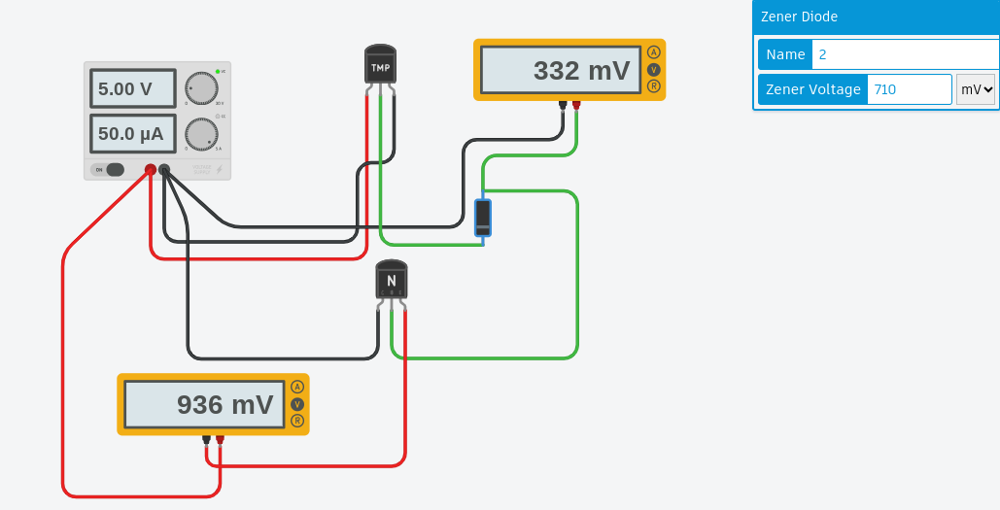

# Build Skills - Task 2

## Section 1 - Model to problem and problem to model exploration

## Section 2 - Exploring TinkerCAD

### 2.1 - Overall functioning of the system

The assigned circuit is designed to be a thermostat that holds the temperature of a device within an acceptable range (20-25 has been set in the code). The thermostat has an LCD output where it describes, with text, what it is doing. By watching the screen the user can see what temperature the thermostat is set to as well as what the current temperature reading is and whether or not the misrocontroller has activated the heater or the fan. As it is, the device doesn't have blades attached to the DC motor or a heating element but all the control and user interface elements are in place. 

The image below denominates several of the components of the circuit by assigning each a number.  

The following is a description of the function of each of the components as per the numbering assigned in the image. 
1. **Arduino Uno**. This microcontroller translates the voltage on pin `A0` into a temperature reading. The input is processed by C++ code that have been flashed to the microcontroller. It sends text output to the LCD. Depending on the temperature, it can turn the heater (pin 8) or the fan (pin 6) on or off. 
2. **Temperature sensor**. The voltage from the middle sensor of this component is determined by the ambient temperature. when it is cold the middle pin has a low voltage, when it is very hot the voltage approaches the input voltage from the left-most pin.
3. **DC Motor**. The motor supposedly runs a fan that can cool the system down. Its speed is determined by the voltage supplied. 
4. **"Heater"**. this resistor and LED represent where a heating element could be conected up. it would raise the ambient temperature When supplied with current. As it is the LED will light up to show when the heater would be activated.
5. **NPN Transistor**. This is an electical switch. using this transistor, a higher voltage circuit could be controlled by the 5V output coming from pin 6 of the microcontroller. Whenever there is a voltage on the middle pin of the transistor, it will allow current to flow from the left to the right pin.
6. **Zener Diode**. This diode allows current only to flow one way until the voltage of the flow exceeds 5.1V. It effectively protects the motor from ever being overloaded with voltage by providing a less -resistive path for any flow that exceeds its 5V optimum. 
7. **LCD**. This screen takes digital input from the microcontroller. The code in the mictrocontroller uses a dedicated library `LiquidCrystal.h` to generate digital signals that it sends down pins 12, 11, 5, 4, 3 and 2 to produce text on the display
8. **Potentiometer**. efectively a dimmer dial for the LCD screen. The brightness of the LCD depends on the voltage at its `v0` pin. By turning the dial of the potentiometer, the user can change this voltage and so dim the screen. 

### 2.2 - Circuit basic

In the sections below I'll describe some possible modifications that would make the thermostat a simpler device.

#### Remove the LCD - Automatic thermostat
This is the easiest way to dramatically simplify the design. The user has to reflash the microcontroller to change the setting of the thermostat. Seeing as the user can't easiy change the setting of the thermostat, having a temperature readout is a bit pointless. It seems like the whole LCD has been put on just to debug the Arduino code. Debugging should've been done in a simulator. If the designer wants to be able to see whether the mcrocontroller is trying to turn on the heater or the fan, for the purpose of debugging, they could just wire LEDs in parrallell on pins 6 and 8. Without the screen, the thermostat would be able to automatically control the temperature of a device without any human interface. 

#### Remove the heater and fan - Basic garden weatherstation
This would make the design an effective but unnecessarily expensive digital thermometer. The code would have to be changed to remove the elements of checking the temperature against the desired range or sending signals to the fan or heaater. Modifying te code and adding a two buttons it would be possible for the microcontroller to store each days maximum and minimum temperature so that a user could always see the temperature just by looking at the   

#### Remove the arduino - computer fan
This is the simplest design that makes sense to me and [a version can be found on my TinkerCAD page](https://www.tinkercad.com/things/5Rf5lp1LIYW-thermostat-without-microcontroller). Removing the microcontroller and replacing it with a NPN transistor and a zener diode. The base of the transistor takes the analogue output of the temperature sensor via the blocking gate of a zener diode. The collector of the transistor is wired direct to a 5V power source and the emitter will only produce 5v voltage when the analogue signal from the temperature sensor exceeds the blocking voltage of the zener diode. Setting the blocking voltage at 710uV seems to result in the emitter producing 5V at about 50 degrees celcius and dropping to zero volts at 0 degrees celcius. The image below shows TinkerCAD's simulation of the controller at 48 degrees

