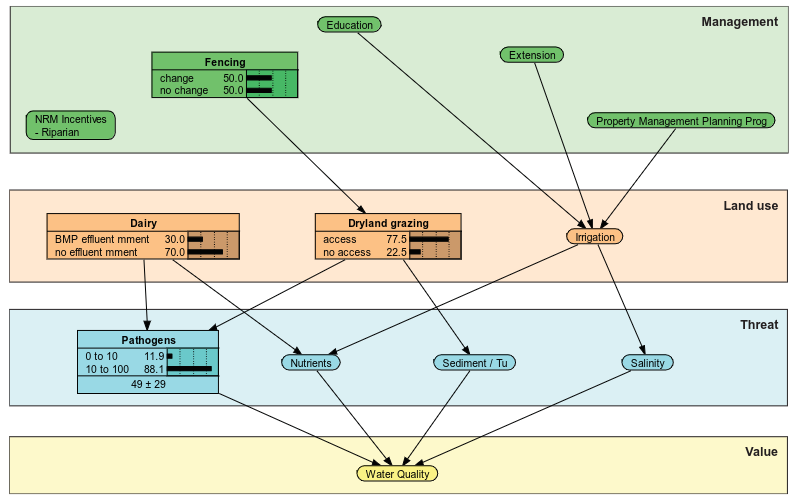
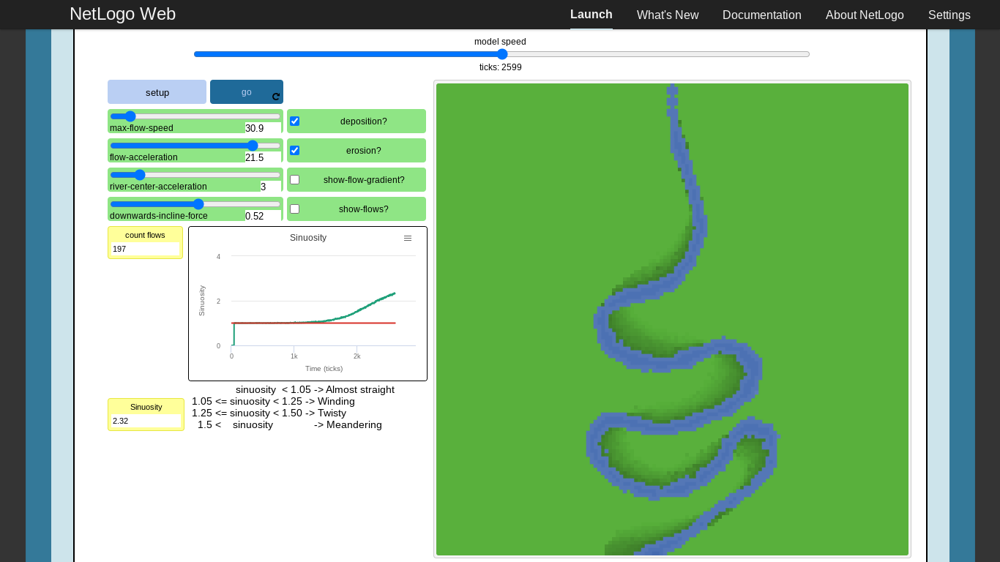
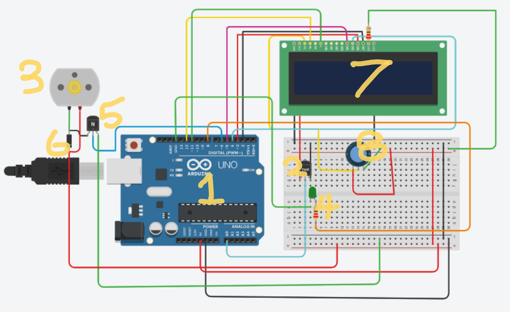
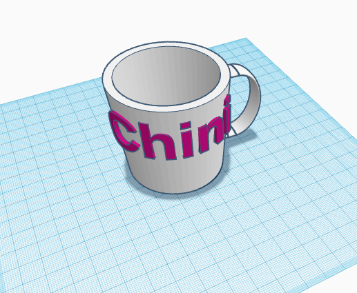
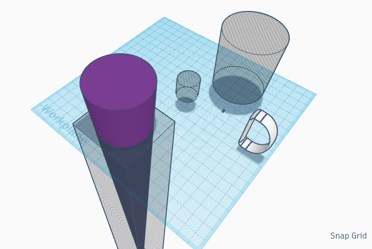

## Section 1 - Model to problem and problem to model exploration

### 1.1  - Model to problem
**Model:**
Bayesian Belief Networks
**Problem:**
How to maximize water quality in a river by expenditure of a fixed budget.

#### Choice of model
To come up with this problem, I drew on my professional experience working in natural resource management. I chose Bayesian Belief Networks (BBNs) because I have previously participated in discussions about applying them to environmental decision  making. I read a couple of articles about the application of Bayesian Networks to environmental issues (Pollino and Henderson 2010, Stewart-Koster *et al.* 2010, Barbrook-Johnson and Penn 2022). I concluded that  Bayesian modelling is well suited to modeling socio-ecological systems where feedback is not a significant feature and decided to focus on the water quality model shown in the Pollino and Henderson (2010) paper.

#### Characteristics of Bayesian Belief Networks

##### Can relate seemingly disparate information
BBNs work by identifying the components ('edges') of the system and the causal links between them. A set of meaningful 'states' is then enumerated for each edge. In the water quality example above, dairy, dryland grazing and irrigation are some of the components. the states for dryland grazing are 'access' and 'no access'. 

Where there is a causal link between two edges a conditional probability table is drawn up relating the probability of each state in edge X for each state in edge Y. In the water quality example, there is a causal relationship between fencing and the access of cattle to the stream. The conditional probability table would show that, if improvements are made to fencing, the probability of cattle having access to the stream would decrease. 

Unlike the link between Dairy effluent treatment systems and prevalence of waterborne pathogens, this association was probably not based on an observed scientific relationship but an expert's best guess of the impact of improved fencing. This is a great strength of applying BBNs to environmental problems where knowledge from many fields has to be combined with local on-ground insights.
      
##### Works well with incomplete data
As stated in the last section, BBNs relate the states of variables to each other using conditional probability tables.  We saw how data can be drawn from expert opinion when there is inadequate data. Another strength of BBNs is their ability to work with missing data. In the water quality example,  the states have not yet been defined for nutrients - we know it is an important component of water quality but it hasn't yet had conditional probabilities defined to link  it with its causes (irrigation and dairy). This BBN could still be run without any further input of meaningful information. The states for nutrients could be defined as 'good' and 'bad' with a 50:50 conditional probability for each of the two states defined for dairy and irrigation. The resulting predictions would not have much scientific rigour behind them but they represent our current 'best guess'. This best guess would inevitably provoke dissent from other stakeholders and the resulting discussion would likely yield some expert input into the correct states and probabilities. The model can be drafted with poor data and iterated with further use.

##### Can be made in a participatory manner
A BBN can be generated through consultative group workshops. The whole structure of the system can elicited from stakeholders. Barbrook-Johnson and Penn (2022) point out that there are two broad approaches: either to teach people what a BBN is and then try to get them to make one while keeping all the limitations of the modelling in mind; or to get people to describe the way the system works in a less structured way. The former approach is very transparent as the resulting model's assumptions and limitations are understood by all stakeholders. 

This feature is perhaps the greatest appeal of using BBNs for modelling environmental systems. Usually, environemntal problems affect many stakeholder groups and they are often politically contested. Barbrook-Johnson and Penn (2022) stressed that the process of making the model is often more valuable than the predictive insights it yields because the new shared understanding of system structure helps to reduce misunderstandings and conflict.
 
##### Structure can be learned from data without human input
In cases where adequate data is available, the structure of the BBN can be learnt from data using neural networks. This is a completely different application of the concept of BBN to the participatory approach outlined above. It is not very applicable to environmental problems as quality data on the social interface of environmental issues usually does not exist. I will mention this feature of BBNs in reference to other problems below.

##### BBNs don't represent feedback well
Representing feedback in BBNs  is difficult. In the case of a one-shot expenditure of a budget, there is limited feedback between the actions of human managers and the environment as the decision about how to invest and how that decision is made, can be revised at the conclusion of the project timeframe.

System dynamics is a better approach for speculative modelling of systems. Systems dynamics takes a direct approach to addressing feedback and so can better represent the behaviour of systems over the full range of conditions. It is however, not 

#### Other problems that suit this technique 
 1. **Diagnosis of patients** - Often, especially in emergency situations, doctors have to make diagnoses based on limited information. Their professional experience, however, has given them a lot of annecdotal data about the likelihood of different diseases given the outcome of different tests. For example, a patient presenting with a cough is very much more likely to have the flu than lung cancer or tuberculosis, though the latter two are possible. If the patient has had the cough for more than a month then the doctor may decide to x-ray the patient's chest or perform a blood test to constrain the probability enough to make a diagnosis. A BBN can be constructed to simulate this type of reasoning and so help with diagnosis. In hospital settings there may even be adequate data available to train the model from data as discussed above. 
 3.  **Rapid assessment of ecological health** - Much the same as with diagnosing patients. For undertaking ecological fieldwork, BBNs could be very useful to input limited or anecdotal observations of ecosystem health and get a prediction of the outcome of a rigorous ecosystem health assessment. This could allow citizen scientists to get an estimate of ecosystem health from the observations that they can make and help professional ecologists to target their survey effort on questions that can't be resolved by lay people.  
 4. **Predicting the outcome of horse races** - This is a problem to which BBNs are well suited. Lots of different factors go in to the performance of a horse in a specific race for example, parentage, trainer, jockey, recent form, previous performance in this event, track conditions etc. We can't define the mechanism by which the factors influence performance but it is clear that there is a correlation. This is a case where BBNs the structure of a BBN could realistically be learned from data as horse performance, and a lot of data on the underpinning conditions, is available.
 5. **Forecasting commodity prices**

#### Other interesting findings
Bayesian Belief Networks have their origin in the Symbolic AI project. The original paper describing BBNs by Judea Pearl (1985) was presented to a conference of the cognitive science society. In the paper, Pearl discusses a model of how humans make decisions in the face of uncertainty and speculates on how to get a computer to do the same thing. 

### 1.2 - Problem to Model
**Problem:**
Will a river form on my stream table?
**Model:**
Newtonian physics. More specifically, Manning's hydraulic model of open channel flow and the Rouse equation.

#### Overview
For my maker project, I am building a cybernetic stream table. For the stream table to be interesting and informative, it needs to accurately simulate the behavior of a river in dynamic equilibrium. This means that changes in the rate of water flow should result in changes to the shape of the river via the transport of particles of sediment. There's a fine balance to be struck between a river that is immutable and boring or a chaotic mess that doesn't resemble a river at all. The slope of the table, the rate of water flow, and the density, size and shape of sediment particles are all elements of the design that will ultimately determine the type of river behavior that is simulated.

 Having researched a few methods of modelling my stream table, I have decided to try to model different combinations of parameters using an extended set of Manning's equations of open channel flow. The key variable I'll be looking at is the Rouse number which indicates whether particles, of a given shape, size and density, can be entrained by a river. 
 
#### Model Choice criteria
1. **Effective** - The model needs to be able to predict sediment transport, using parameters I can alter with my design, with some accuracy. It doesn't have to be perfect as I am willing to spend a little bit of time experimenting with the physical model however, it needs to set me on the right track. Being able to identify unviable combinations of medium, flow rate, slope and particle size will save a lot of trial and error in the prototyping phase. 
2. **Context appropriate** - I am doing this for my maker project, so I have a $200 budget and about 60 days. The time and resources invested in the model has to be commensurate with what I have available. I can't spend most of my remaining time working on the model and then not have time to build.  The manning's model has the advantage of familiarity for me: as I've worked with it before, the effort required to learn the modelling approach is greatly reduced.
3. **Reproducible** - I value decentralization of knowledge. I am designing the cybernetic stream table in such a way that it should be an easy DIY project for other environmental educators to copy. The model to predict sediment transport is an important part of that as it informs many of the early design decisions in the production of a cybernetic stream table.  As such one of my criteria for the applicability of the cybernetic stream table is that my model could be rerun by a lay-person with different variables.
4. **Legible** - For reasons articulated with respect to reproducibility, the model outputs, and the underpinning assumptions should be easily understood a lay person.  

#### Assessment process
 The academic literature offers many alternatives for predicting the behavior of rivers. Many of these would likely have met my effectiveness criteria above but I didn't find anything else that met the context appropriate criteria. Some models involved 3d fluid dynamics simulations or neural networks, which are very computationally demanding, and definitely would have exhausted my $200 budget. I suspect that nothing currently being published in the sediment transport and fluid dynamics literature would meet my context appropriate or legible criteria.

On the other end of the spectrum, Netlogo includes a model of the formation of meander bends (see image below). The model is based on the agent modelling paradigm and is based around the interaction of 'turf' and 'flow' agents. I found this model to be really fun to play with and the simplicity of its methodology was really appealing. It meets all of my above criteria except for efficacy. Seeing as the model does not actually represent sediment particles, it can't inform me about how to combine the parameters that I can set in my design. 

A screenshot of Netlogo's river meandering model

Wikipedia's articles on sediment transport ultimately pointed me to the Rouse equation and the use of Manning's equations to get the bed shear velocity. I  was already familiar with Manning's equations so this immediately stood out as an achievable way forward.

#### Interesting findings
I'm considering using granulated plastic instead of sand for the medium of the stream table as I've seen professional products on the internet set up this way. I believe that the plastic will be slightly less dense than water and so float! This would show up in the equations of my model as a square root of a negative number! Basically, plastic would be entrained by any water flow approximately as deep as the plastic particle's diameter and he only limitation on transport would be the friction of surrounding particles. This would make the whole sediment transport modelling exercise futile. 
## Section 2 - Exploring TinkerCAD

### 2.1 - Overall functioning of the system

The assigned circuit is designed to be a thermostat that holds the temperature of a device within an acceptable range (20-25 has been set in the code). The thermostat has an LCD output where it describes, with text, what it is doing. By watching the screen the user can see what temperature the thermostat is set to as well as what the current temperature reading is and whether or not the misrocontroller has activated the heater or the fan. As it is, the device doesn't have blades attached to the DC motor or a heating element but all the control and user interface elements are in place. 

The image below denominates several of the components of the circuit by assigning each a number.  

The following is a description of the function of each of the components as per the numbering assigned in the image.

1. **Arduino Uno**. This microcontroller translates the voltage on pin `A0` into a temperature reading. The input is processed by C++ code that have been flashed to the microcontroller. It sends text output to the LCD. Depending on the temperature, it can turn the heater (pin 8) or the fan (pin 6) on or off. 
2. **Temperature sensor**. The voltage from the middle sensor of this component is determined by the ambient temperature. when it is cold the middle pin has a low voltage, when it is very hot the voltage approaches the input voltage from the left-most pin.
3. **DC Motor**. The motor supposedly runs a fan that can cool the system down. Its speed is determined by the voltage supplied. 
4. **"Heater"**. this resistor and LED represent where a heating element could be conected up. it would raise the ambient temperature When supplied with current. As it is the LED will light up to show when the heater would be activated.
5. **NPN Transistor**. This is an electical switch. using this transistor, a higher voltage circuit could be controlled by the 5V output coming from pin 6 of the microcontroller. Whenever there is a voltage on the middle pin of the transistor, it will allow current to flow from the left to the right pin.
6. **Zener Diode**. This diode allows current only to flow one way until the voltage of the flow exceeds 5.1V. It effectively protects the motor from ever being overloaded with voltage by providing a less -resistive path for any flow that exceeds its 5V optimum. 
7. **LCD**. This screen takes digital input from the microcontroller. The code in the mictrocontroller uses a dedicated library `LiquidCrystal.h` to generate digital signals that it sends down pins 12, 11, 5, 4, 3 and 2 to produce text on the display
8. **Potentiometer**. efectively a dimmer dial for the LCD screen. The brightness of the LCD depends on the voltage at its `v0` pin. By turning the dial of the potentiometer, the user can change this voltage and so dim the screen. 

### 2.2 - Circuit basic

In the sections below I'll describe some possible modifications that would make the thermostat a simpler device.

#### Remove the LCD to make an automatic thermostat
This is the easiest way to dramatically simplify the design. The user has to reflash the microcontroller to change the setting of the thermostat. Seeing as the user can't easiy change the setting of the thermostat, having a temperature readout is a bit pointless. It seems like the whole LCD has been put on just to debug the Arduino code. Debugging should've been done in a simulator. If the designer wants to be able to see whether the mcrocontroller is trying to turn on the heater or the fan, for the purpose of debugging, they could just wire LEDs in parrallell on pins 6 and 8. Without the screen, the thermostat would be able to automatically control the temperature of a device without any human interface. This could be useful for scientific instruments that are left out in the field to perform remote monitoring.

#### Remove the heater and fan to make a basic garden weatherstation
This would make the design an effective but unnecessarily expensive digital thermometer. The code would have to be changed to remove the elements of checking the temperature against the desired range or sending signals to the fan or heaater. Modifying te code and adding a two buttons it would be possible for the microcontroller to store each days maximum and minimum temperature so that a user could always see the temperature just by looking at the screen. Holding down each of the push buttons would allow the user to see the minnimum or maximum temperature for the day. If this were housed in a waterproof box it would be a useful tool to help gardeners decide how much water their garden needs.

#### Remove the arduino to make a computer fan
This is the simplest design that makes sense to me and a version can be found on [my TinkerCAD page](https://www.tinkercad.com/things/5Rf5lp1LIYW-thermostat-without-microcontroller). I removed the microcontroller and replaced it with an NPN transistor and a zener diode. The base of the transistor takes the analogue output of the temperature sensor via the blocking gate of the zener diode. The collector of the transistor is wired direct to a 5V power source and the emitter will only produce 5v voltage when the analogue signal from the temperature sensor exceeds the blocking voltage of the zener diode. Setting the blocking voltage at 710uV seems to result in the emitter producing 5V at about 50 degrees celcius and dropping to zero volts at 0 degrees celcius. The image below shows TinkerCAD's simulation of the controller at 48 degrees.

This design would be a cheap way of turning on a fan to cool down an electronic device, such as a computer, when the device gets hot.

### 2.3 3D model design of your maker project

I don't want to make a 3D model of my whole maker project as I'm trying to build it ad-hoc from recycled materials. One goal of the project is that the camera system will be adaptable to any stream table design so that users can mount the camera on any stream table that suits their purposes. 

#### Design
Below is an image of one of the [mugs that I designed during Hannah Feldman's session](https://www.tinkercad.com/things/2OuiY33WMQn-chini-mug?sharecode=q7KdC7wDqpMq9B6tlKIiLiTwrksyz-cfvG103eeSo34).

The mug's model is available from my TinkerCAD page:

[https://www.tinkercad.com/things/2OuiY33WMQn-chini-mug?sharecode=q7KdC7wDqpMq9B6tlKIiLiTwrksyz-cfvG103eeSo34](https://www.tinkercad.com/things/2OuiY33WMQn-chini-mug?sharecode=q7KdC7wDqpMq9B6tlKIiLiTwrksyz-cfvG103eeSo34)

#### Process:
I had a mug in fron of me while working on the model, however the shape of the mug that I had was too complicated to easily draw with TinkerCAD. The handle of the mug was composed of four different three-dimensional compound curves. I had to simplify the design a fairbit to make it achievable. I decided that my mug would consist of a hollow, tapered cylinder and a D-shaped handle. As a bit of a design feature I decided to add embossed decorative lettering. The below image shows all the parts of my mug design.

Here's how I put it together:

1. I found a D-shaped ring offered by the TinkerCAD community so this sorted out the handle.
2. For the tapered cylinder, I made a cone of height 100 and then covered most of the top of it with a negative-space block. Flipping this over made me a tapered cylinder.
3. To hollow out the cylandir, I duplicated the tapered cylinder object that I had. I scaled the new object down slightly, used the align tool to make it concentric with the other cylinder, switched it to negative-space and lifted it slightly off the base plate.
4. Grouping the negative and positive cylandirs gave me a cup shape.
5. I slightly rotated the D ring so that sat as flush as possible with the edge of the mug.
6. I added cylindrical text using a tool from the TinkerCAD library. Chini is my partner's name.
7. Lastly, the D-ring object came with a small chip of material floating beside it. this ended up inside the mug and could've caused major issues if someone were to 3D print the design. I added a small cylinder of negative space to erase this artefact.   

## Acknowledgments
Thanks to Safiya for granting an extension on this assignment. I wouldn't have had much to submit on the due date. Thanks also to Dave Harty for pointing me to the Netlogo model of river meanders - it isn't useful for designing the stream table but I think it will be a useful tool for communicating about my project. 

## References
::: {.csl-bib-body style="line-height: 2; padding-left: 1em; text-indent:-1em;"}
::: csl-entry
Cain, J, 2001, *Planning Improvements in Natural Resources Management*,
Centre for Ecology and Hydrology, Wallingford.
:::

::: csl-entry
Pollino, CA & Henderson, C, 2010, *Bayesian networks: A guide for their
application in natural resource management and policy*, p. 48.
:::

::: csl-entry
Stewart-Koster, B, Bunn, SE, Mackay, SJ, Poff, NL, Naiman, RJ, & Lake,
PS, 2010, 'The use of Bayesian networks to guide investments in flow and
catchment restoration for impaired river ecosystems', *Freshwater
Biology*, vol. 55, no. 1, pp. 243--260.
:::
:::
