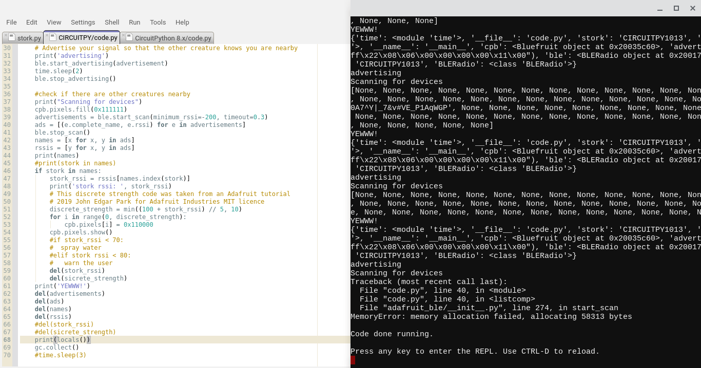

---
title:  Bluetooth Defense Axolotl - Project Timeline
author: William McAlister
geometry: margin=1cm
---

# 2024-04-15
- Came up with the idea of using the axolotl head from our CPS stories assignment.
- Decided to use a pump as the actuator to advance my project for presentation on demo day.

# 2024-04-16
- Attended the Build studio workshop and wrote code to control the neopixels and a servo motor via the pinout interfaces of the Bluefruit.
- Read [Adafruit's tutorial](https://learn.adafruit.com/hide-n-seek-bluefruit-ornament/code-with-circuitpython) on Bluetooth proximity sensing and decided to use bluetooth as the sensor.

# 2024-04-17
- Followed [Adafruit's tutorial](https://learn.adafruit.com/hide-n-seek-bluefruit-ornament/code-with-circuitpython) to understand code that detects the proximity of Bluetooth devices.
- Wrote code to list all Bluetooth devices in the environment.
- Learnt to identify specific Bluetooth devices from their advertisements.
- Based on adafruit's tutorial. Wrote code to detect the proximity of a specific Bluetooth device,
- Struggled with stack overflow errors.

# 2024-04-18
- Tested how the pump works using a laboratory power supply.
- Figured out how to connect hoses to the pump.

# 2024-04-21
- Bought some plumbing fittings.
- Borrowed a 12v battery from my uncle.

# 2024-04-22
- Talked with Muhammed Asfour about the best way to control a DC motor.
- Used the laboratory power supply to test how a relay switch functioned.
- Progressed the code. Struggled with stack overflow errors (see image below).

# 2024-04-23
- Read [Adafruit's documentation on the pinout interfaces](https://learn.adafruit.com/adafruit-circuit-playground-bluefruit/pinouts).
- Wired the pump and the Bluefruit together via the relay switch. 
- Wrote simple code so that the Bluefruit would periodically switch the pump on and off (see test_relay_switch.py)

# 2024-04-24
- Combined the sensor and actuators together so that the pump ran when the axolotl detected the stork in close proximity.
- Tested using a battery to power my pump. 
-  Completed a viable set of code for both the axolotl (see axolotl_combined.py) and the stork.
- Major struggles with stack overflow errors in the lab environment presumably because of the number of Bluetooth devices around.

# To-Do 2024-04-25
 - [x] Draw the Axolotl eye
 - [x] Solder the axolotl eye
 - [x] Fit the eye to the head
 - [x] Attach the battery into the head
 - [x] Attach the relay to the side of the head
 - [x] Fix the stork code to broadcast reliably
 - [x] Code the warning into the axolotl
 - [x] Code the eyes for the stork 
 - [x] Tidy up the wiring
 - [x] Do a full assembled test outdoors
 - [x] Get a video of me playing with it
 - [ ] Eliminate stack overflow issues in the code

## Video 

### Why?
 - [ ] I've made two creatures that interact via Bluetooth.
 - [ ]  I've learnt to use the Bluetooth sensor.
 - [ ] I've also learnt how to control a 12v circuit with a 4v circuit and a to control a flow of water with a flow of electricity. 
 - [ ]  I chose to make an axolotl and a stork because of an in-joke that started with our CPS stories presentation.
 - [ ] I didn't have much time this fortnight so I decided to re-purpose an existing creature rather than starting from scratch.
 - [ ] I chose to use these sensors and actuators because I am aiming to employ the same components in my maker project.
 - [ ] The choice of Bluetooth caused some headaches. I think it was pushing the limits of the Bluefruit hardware. 
 
### What?
 
 - [ ] Explain how the stork works.
 - [ ] Explain how the Axolotl works.
 - [ ] Explain how to setup the axolotl to see it working.
 - [ ] Explain what can go wrong.
 - [ ] Explain the challenges: Stack overflow from BLE, electrical connections are a bit flimsy, the pump can stall with air bubbles.

### How?

 - [ ] Talk about the sensor, actuator and physical components as three separate streams of development that were brought together at the end.
 - [ ] Refer the user to the supplementary docs to see a couple of iterations of the code.
 - [ ] To make the Bluetooth sensor, I followed [a tutorial from Adafruit](https://learn.adafruit.com/hide-n-seek-bluefruit-ornament/code-with-circuitpython).
 - [ ] It was a really satisfying experience. The code worked immediately when loaded onto my two Bluefruits and I easily understood how the code worked and was able to make changes. I learnt a lot about bluetooth from the tutorial.
 - [ ] I think Adafruit does a phenomenal job with their tutorials and I really like that they release their code open-source.

### Acknowledgements
 - [ ]  I basically need to thank everyone this fortnight.
 - [ ] Biggest thanks to Tianee for making the axolotl costume in the first place and for being my videographer.

## Supplementary Docs
 - [ ] Include this to-do list
 - [ ] Augment this to-do list to show the timeline of what I did on each day and a couple of reflections.
 - [ ] Include some of the intermediate python code linked from the text.
 - [ ] Include a screenshot of some errors.

