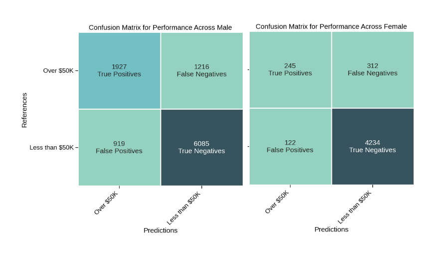

# Background
There are many ways to view fairness. What's more, [no one definition is the best for all situations.](https://www.youtube.com/embed/jIXIuYdnyyk)

## Choice

*Intro to Fairness in ML with Tensor Flow*

I chose this task because it includes TensorFflow and I get to build a neural net. I'd like to make some custom neural nets during this semester so getting familiar with the python libraries seemed like a good opportunity. 

# Fair Aware Tasks

## Fair Aware Task #1

### Are there missing feature values for a large number of observations?

 - Most people didn't report a loss or gain of capital. 
 - More than 5% have a missing value for work class. 'Never worked' is an option and so is 'without pay'. Did these people feel that none of the categories properly described the work they do? Maybe some full-time parents would feel that they aren't in any of those categories?
 - More than 5% haven't listed an industry for their occupation despite a catch-all "other" category. It would be interesting to see how this group intersects with the people who didn't put down a work class.

### Are there features that are missing that might affect other features?

 - Geographic location. I have the feeling that immigrants and women are under represented in the data. This might make sense if it is a dataset for a regional or remote area with a lot of itinerant workers. The wide distribution of occupations and industries suggests that it is not a remote area.

### Are there any unexpected feature values?

 - "Not in family" is the second most common relationship status reported after husband and before wife.
 - There are fewer migrants than I would've expected for the US.

### What signs of data skew do you see?

- Men outnumber women at about 2:1.
- The data is about the US population so isn't directly relevant to other nations.

### Reflections on the Hidden Solution

The hidden solution didn't make any new points but it did show some code that will allow us to remove records with missing data from the database. Is this a fair approach?Maybe there is a reason that people's responses to work related questions didn't match to a category.

## Fair Aware Task #2

### In the Binning | X-Axis menu, select education, and in the Color By and Label By menus, select income_bracket. How would you describe the relationship between education level and income bracket?

 - It seems that there is a pretty clear relationship between education and income. You are much more likely to have a salary over $50K if you are highly educated.
 - However, there are some factors limiting this analysis. Getting an education takes time. Building a career also takes time. To some extent the two must trade off against each other. Because we only have two categories for income (high/low) it is possible that we are missing this pattern. Perhaps having a masters makes it more likely that you'll earn $60K but less likely that you'll earn $120K.

### Next, in the Binning | X-Axis menu, select marital_status, and in the Color By and Label By menus, select gender. What noteworthy observations can you make about the gender distributions for each marital-status category?

 - Though women are outnumbered 2:1 in this dataset they form the majority in the `separated`, `widowed` and `divorced` categories. Men form the overwhelming majority in the `married-civ-spouse` (married with a spouse who's not in the armed forces?) category. Could this be a reflection of different ontologies between the sexes? Perhaps some men are in denial about their marriages breaking down.
 - This data is from the 90s so I'm going to assume that most marriages are not gay marriages. It is hard to make sense of the data. Where are all the women that these men are supposedly married to? 

### Reflections on the Hidden Solution
Interesting. The inference that married women are underrepresented in this dataset helps me to understand the questions that I had raised. I wonder if it interacts with the issue of reporting your occupation. As I mentioned above, I reckon full-time parents would not feel satisfied with the industry and occupation choices offered. Full-time parenting is a more common occupation for women than men. We should be careful that our discarding data with missing values doesn't further skew the dataset away from married women.

The lesson is that we really have to be careful when scruitinizing data. It might seem like it is representative of real patterns but there are many ways the measurement or collection of the data can seriously skew it.

## Fair Aware Task #3

### Chosen Feature
*Which of the following features might pose a problem with regard to fairness?*

We know that married women are under-represented. Given what we've seen **Gender and marital status** might pose problems for our model fairly predicting people's income. Suppose that a model derived from this dataset were deployed to help determine eligibility for credit. It has a much poorer understanding of women than of men. When the model is tasked with predicting the income of a married woman I expect that it will have a higher error rate than doing the same for a married man. This is because it has a lot less information to base its predictions on and our analysis suggests that there is something systemic driving it.   

### Reflections on the Hidden Solution
The idea that we might be able to fix the dataset by upsampling women is interesting. I gues we could get some more reliable figures about the gender ratio in the US and the distribution of married versus unmarried. We could then throw out data rows in such a way that we get closer to representative demographics. Still, if there is a systemic reason why married women aren't included I'm not sure that this approach would counter it.

## Fair Aware Task #4
### Observations
The model is a bit problematic but not necessarily in the way I expected. The below image shows the confusion matrices for men and women side-by-side.

I also calculated some performance metrics by hand to get a feel for them. The table below shows the accuracy, precision, recall and error rate for men, women and the combined testing dataset. 

|  | Accuracy | Precision | Recall | ER |
| -------- | --- | --- | --- | --- |
| Men      | 79% | 68% | 61% | 26% |
| Women    | 91% | 67% | 44% | 44% |
| All Data | 83% | 68% | 59% | 21% | 

If you only looked at the metrics for the whole model you might form the conclusion that this model is somewhat low performance but still useful. If you split men and women and calculated accuracy and precision for each, you might even draw the conclusion that the model is unfair because it performs better for women! What is really telling for this model is to compare recall and error rates between the sexes. Women have a much higher error rate. I believe this is driven by false negatives. The recall rate for women is much lower suggesting that the model often fails to recognize high income women as such.  

What's more, the gender bias in the model as it stands is a reflection of its inability to represent women in its own dataset. As discussed above, there is good reason to believe that its dataset misrepresents women by excluding married women. If it is the case that married women have higher incomes than their unmarried, widowed and divorced sisters (which seems plausible) then this model is skewed to underestimate women's income by two separate but compounding biases. The strong gender bias in this model should preclude it from use. 

### Reflections on the Hidden Solution
Wow, the point about overfitting joined some dots for me:

> What this is all suggesting is that the model is ***overfitting*, particuarly with respect to female and lower income bracket**. In other words, this model will not generalize well, particularly with female data, as it does not have enough positive examples for the model to learn from. It is **not doing that much better with male, either, as there is a disproportionately small number of high income bracket compared to low income bracket** — though not nearly as poorly represented as with female.

It makes a really good point, precision is higher than accuracy for men too. This implies that the model is overfitted. There are ~30% more false negatives for men than false positives.  

# Acknowledgments
Thanks to Gemini AI and the stack overflow community for helping me to solve a dependency issue with the Colab code notebook. I had to downgrade from the defaut version of Tensor Flow on google's servers (2.17). Going back to version 2.13 got everything working.  
