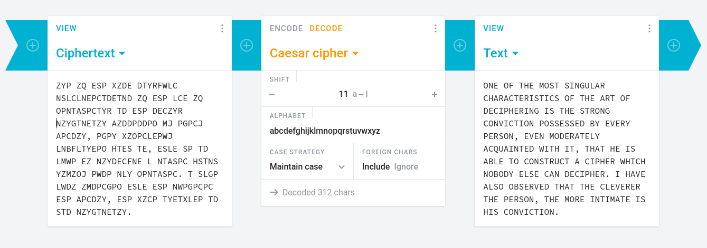
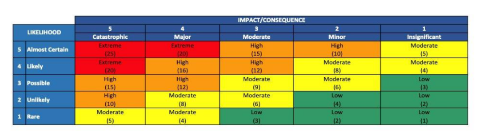

# Part 1 - Break a cipher

## Decryption

This is the cipher I was given:

> ZYP ZQ ESP XZDE DTYRFWLC NSLCLNEPCTDETND ZQ ESP LCE ZQ OPNTASPCTYR TD ESP DECZYR NZYGTNETZY AZDDPDDPO MJ PGPCJ APCDZY, PGPY XZOPCLEPWJ LNBFLTYEPO HTES TE, ESLE SP TD LMWP EZ NZYDECFNE L NTASPC HSTNS YZMZOJ PWDP NLY OPNTASPC. T SLGP LWDZ ZMDPCGPO ESLE ESP NWPGPCPC ESP APCDZY, ESP XZCP TYETXLEP TD STD NZYGTNETZY.

I used the online tool from [cryptii.com](https://cryptii.com/) to decode the cipher. By a process of trial and error, I found that it has a **shift of 11**. The decoded Message reads:

> ONE OF THE MOST SINGULAR CHARACTERISTICS OF THE ART OF DECIPHERING IS THE STRONG CONVICTION POSSESSED BY EVERY PERSON, EVEN MODERATELY ACQUAINTED WITH IT, THAT HE IS ABLE TO CONSTRUCT A CIPHER WHICH NOBODY ELSE CAN DECIPHER. I HAVE ALSO OBSERVED THAT THE CLEVERER THE PERSON, THE MORE INTIMATE IS HIS CONVICTION.



## Improvements

If you often needed to break caesar ciphers, you could automate this process a little bit more by having a script test all possible permutations at once. If you save the cipher as a txt file. It would be possible to try all possible permutations in bash using the following script

```bash!
for i in {1..25}; do
    echo "Shift $i:"
    tr "$(printf %${i}s | tr ' ' '[A-Za-z]')" "$(printf %${i}s | tr 'A-Za-z' '[A-Za-z]')" < cipher.txt
    echo
done
```


This automates the process of testing all 25 possible permutatons. A human still needs to read each version of the output text to see if it is sensible. Further automation would result from getting the computer to check the output for sensibility. There are two approaches. 

### Test for sensible words
One would be to take some of the output and check if the words are dictionary words. You can download a version of the [Moby dictionary](https://en.wikipedia.org/wiki/Moby_Project) like this:

```bash
wget https://github.com/dwyl/english-words/raw/master/words.txt 
```

Adding a loop to generate and save possible permutaions, the core of the code would test each permutation like this:


```bash!
cat permutation.txt | tr '[:upper:]' '[:lower:]' | tr -s '[:space:]' '\n' | grep -Fx -f ./words.txt | wc -l
```

### Test for character frequency
Rather than grepping a 4.6Mb file many times, it would be much more efficient to test the [letter frequency](https://en.wikipedia.org/wiki/Letter_frequency) of each permutation. In real English text, E occurs more often than other characters. According to the Wikipedia article:

>Herbert S. Zim, in his classic introductory cryptography text Codes and Secret Writing, gives the English letter frequency sequence as "ETAON RISHD LFCMU GYPWB VKJXZQ"...

There's a bit of statistics involved, so you'd have to write or find some custom software rather than relying on standard command line utilities but checking the letter frequency of each possible shift would allow you to identify the right shift.

### Best method
Calculating the frequency on the cipher would actually be the most computationally efficient way of breaking an arbitrary caesar cipher. If you calculate the letter frequencies, you will find that there is a similar distribution to real English writing but that, for example, X is the most common letter instead of E. This would indicate a shift of -7. This approach is not nearly as demanding of computational resources as the method that brute forces all possible permutations. 

This method relies on some of the redundant information in the message to break the cipher. The frequency of occurence of different letters isn't enough to know the message, but it is enough to know whether it is a message in English. We don't need to process the whole message break the caesar cipher. This little bit of metadata is enough. 

# Part 2 - Code Analysis

## CPS Security Script
*This section is my analysis of the `cps_security.py` and `cps_secure_harness.py` script*

### What does the code do and how is this achieved?
This script defines four functions:
1. `caesar_cipher_encrypt`
2. `caesar_cipher_decrypt`
3. `vigenere_cipher_encrypt`
4. `vigenere_cipher_decrypt`

Each of these functions takes a string as input and outputs a string. There is an adittional input for each function that specifies how to encode the cipher. 

#### Caesar Cipher
The caesar cipher functions require a number that specifies the shift. In the example below we shift our input string by one and then shift it back. 'H' becomes 'I', 'e' becomes 'F' etc.

```python!
# Encrypt a message with the caesar cipher
>>> caesar_cipher_encrypt('Hello World!', 1)
'IFMMP XPSME!'

# Dcrypt a message with the caesar cipher
>>> caesar_cipher_decrypt('IFMMP XPSME!', 1)
'HELLO WORLD!'
```

This is achieved using a global variable `ALPHA = "ABCDEFGHIJKLMNOPQRSTUVWXYZ"`. This is the most important part of the caesar cipher function:

```python!
if (char.upper() in ALPHA):
    index = ALPHA.index(char.upper())
    cryptindex = (index + shift) % len(ALPHA)
    newchar = ALPHA[cryptindex]
```

Notice in the example above that the punctuation is not encrypted. The following line `if (char.upper() in ALPHA):` ensures that the cipher only works on alphabetic characters. This is the line where we pick the letter that has had the shift applied to it: `newchar = ALPHA[cryptindex]`.

#### Vigenere Cipher

The vigenere function, as implemented in this code, relies on the `ord` function as in this important line: `shift = ord(key[key_index])`.

```python!
>>> help(ord)
Help on built-in function ord in module builtins:
ord(c, /)
    Return the Unicode code point for a one-character string.
```
The ord function uses the unicode library to assign a number to any character in the string. However, as shown in this line, `newchar = ALPHA[cryptindex]`, It just uses the unicode index to cycle through the same `ALPHA` global variable as the caesar cipher.

>Unicode, formally The Unicode Standard, is a text encoding standard maintained by the Unicode Consortium designed to support the use of text in all of the world's writing systems that can be digitized. Version 15.1 of the standard defines 149813 characters and 161 scripts used in various ordinary, literary, academic, and technical contexts. 

```python!
>>> vigenere_cipher_encrypt("Hello world!", "Wow!")
'QLASX DDYUK!'

>>> vigenere_cipher_decrypt('QLASX DDYUK!', "Wow!")
'HELLO WORLD!'
```

#### Improvements
there's about 50% redundancy in this code, the only difference betwwen the encrypt versus the decrypt functions is, at the crucial step, they use addition and subtraction respectively. All the code except one character is the same. This is bad software development practice as it is an unneccessary increase in the aount of code that must be maintained. These functions should be merged to eliminate code duplication. 

#### CPS Secure Harness

This code is a wrapper for the functions in `cps_security.py`. It helps you to run the program from the shell. For example the following bash command would encrypt its own source file using the vigenere cipher with the key `Whales and Dolphins` 

```bash!
python3 cps_secure_harness.py -e "$(<cps_secure_harness.py)" -k "Whales and Dolphins" > cps_secure_harness.py.ciphered
```
The wrapper works by imorting the argparser library to easily define a set of arguments as per conventional bash syntax:

```python!
argParser.add_argument("-d", "--decrypt_text", help="the encrypted text you wish to decrypt")
argParser.add_argument("-e", "--encrypt_text", help="the plain text you wish to encrypt")
argParser.add_argument("-k", "--key", help="enter key text for a Vigenere cipher")
argParser.add_argument("-s", "--shift", type=int, help="fixed shift number for a Caesar cipher")
```

Argparser also respects bash convention by automatically generating a help message that is printed when the user specifies `-h` or `--help` as an argument.

This wrapper should default to printing the encrypted/decrypted message to stdout instead of also printing log messages such as it does in the following snipet `print("in: ", args.encrypt_text)` Also, it should default to reading input from the stdin unless an input file, or input message, is specified. It would also be good practice to specify the interpreter in line 1 like so: `#! /usr/bin/python3`. 

### How secure are the methods of encryption and decryption and why?

#### Caeser Cipher
As I wrote in Part 1, the caeser cipher is easy to crack using letter frequencies. Any computer that can run the linux kernel could easily crack a caeser cipher in a very short time. I reckon you could even crack a caesar cipher on a microcontroller like a microbit or a bluefruit. 

#### Vigenere Cipher
A Vigenere cipher with a single letter key is the same as the caesar cipher and so can be easily cracked by the same method. 
With a multi letter key, the vigenere cipher is a fair bit harder to crack. Here I use the vigenere function to encrypt a message and then manage to recover half the letters with a caesar decryption:

```python!
>>> vigenere_cipher_encrypt("The quick brown fox jumps over the lazy dog", "go")
'SOD XTPBR AYNDM MNE IBLWR VULQ AGL KHYF CVF'

>>> caesar_cipher_decrypt('SOD XTPBR AYNDM MNE IBLWR VULQ AGL KHYF CVF', 25)
'TPE YUQCS BZOEN NOF JCMXS WVMR BHM LIZG DWG'
```
If you knew that it were looking for a 2 letter key, and you had a lot of practice, you might be able to recognize that this is a partial solution. The fact that first word is three letters long and almost matches the most common three letter word in the English language suggests that we're on track. 

Knowing the length of the key is the first crucial piece of information that we need. Once you know the length of the key you can try different permutations. To crack the caesar cipher by brute force we only had to try 25 possible permutations. The vigenere cipher has 26<sup>n</sup> possible permutations where `n` is the length of the key. That means, to brute force a message encrypted with a three letter key, we'd have to test 17,576 possible permutations. If we don't know the key length then the equation is more like 26<sup>1</sup> + 26<sup>2</sup> + 26<sup>3</sup> ... 26<sup>n</sup> Hence, knowing the key length greatly reduces the computational intensity.

The spaces and punctuation are not ciphered. This hints at one way of cracking the vigenere cipher. In English, there are only two one letter words ('A' and 'I'). If we took all the one letter words in the ciphered text, we could look for a relationship between the spacing of the same encrypted one letter word. These patterns in the spacing of one letter words give away the periodicity of the cipher and, hence, the length of the key.

From what I've read 


I found a [python script on github](https://github.com/savanddarji/Cracking-a-Vigenere-Cipher/blob/master/Kerckhoffs%20method%20for%20Vegener%20cipher_JMD_GIT.py) that is only 124 lines and can break a vigenere cipher by brute force.
 

### How would you change this encryption technique to make it more secure? What alternative solution would you use?

#### Long Keys
The vigenere cipher is actually pretty secure if you use a long key. However, A key that is longer than the encrypted text doesn't add any security. If you have a key over 100 characters, and you've added salt to the message, it'll be very hard to break.

#### Encrypt Punctuation
One of my ideas for breaking the vigenere cipher relied on using the spaces between words. If you extended the encryption alphabet to include punctuation and spaces, this vulnerability would be eliminated. Also, the longer alphabet increases the possible permutations and so enhances security. 

#### Add salt
My best methods of cracking rely on letter frequencies. Before encrypting the message, you could add a random sequence of non english words. If the length of the salt is proportional to the message, it would eliminate the letter frequency vulnerability. A problem with this is that the content of the salt could confuse your intended recipient. You would need mututally agreed conventions for figuring out what is salt and what is data.

#### Harness improvements
The harness script is extremely insecure. It takes the intended message and the encryption key as command line arguments! Unless the user diligently clears it, this will be saved as plain text to the user's `.bash_history` file. Any malicious actor that gains read access to the user's home folder will be able to see all the messages that they have recently encrypted! This script is poorly designed.

As I said above, the harness should be improved to read from the STDIN and write to the STDOUT. As the user has a lot more control over the permanence of data in these pipes.

#### Better algorithms

One serious limitation of both of these algorithms is that you need to communicate the key to the intended recipient without it being intercepted. This is because both algorithms are symmetrical encryption. You're better off using a key pair method. Instead of this python script you should just install [GNU Privacy Guard](https://gnupg.org/) (GPG) and use its [Pretty Good Privacy](https://www.openpgp.org/) compliant key pair methods. If you need to encrypt from within a python script there is a [python API for GPG](https://pypi.org/project/python-gnupg/).

# Part 3 - Risk Matrix

I read [the report on the ANU data breach](https://imagedepot.anu.edu.au/scapa/Website/SCAPA190209_Public_report_web_2.pdf) I'm going to use the ANU intranet as the CPS that I'll be analyzing.

## Datasets
Below I list some of the datasets that are stored within, and/or circulate around, the ANU network. I've tried to order the data in terms of value to a malicious actor.
 - Network traffic metadata
 - Teaching content
 - Research data (IP)
 - Student administrative data
 - HR data
 - Email
 - Financial data
 - Student credentials
 - Staff credentials

## Risk assessment
In the sections below I'll talk about a few different scenarios, the likelihood that they happen, the consequences and the steps that could be taken to mitigate them. For the sake of talking about likelihood, I'll use a 10 year horizon. In assessing the risks, I'm taking the perspective of ANU as an institution.



### Power outage
**Risk score: 4** 
Likely but insignificant
- I believe that ANU has suffered several power outages in the last 10 years. It is likely that this will happen in the next 10 years. 
 - An outage would stop data from circulating in the network for its duration. It would also crash the servers that store data which would likely lead to a small amount of data loss. An outage does not make data more accessible to malicious actors. 

### Student's credentials stolen by malicious actor
**Risk score: 6**
Possible but minor
- ANU has about 20,000 students. Most of them are lax about cybersecurity. It is almost certain that one of them will use the same password for their university account and other accounts associated with it that are subsequently [pwned](https://haveibeenpwned.com/). Nevertheless, since the 2018 incident, ANU has made 2FA mandatory for all users. It is possible that a malicious actor could steal an authenticator from a student.
- However, students don't have any administrative privilidges on the ANU network so their credentials aren't much use to an actor that is trying to harm the ANU. The actor could do harm to the student by changing their enrollments. From the ANU's perspective, the danger of this scenario is of the credentials being used to send phishing emails that originate from within the organization.

### ANU machine compromised with malware by student
**Risk score: 3**
Rare but moderate consequences

 - Students don't have any administrative privileges to setup software on ANU computers. They can run portable executables and javascript from computers in the library, or when given an ANU device, but ANU ICT has hardened the network to minimise this threat.

### Senior ICT staff member's credentials stolen by malicious actor
**Risk score: 10**
Unlikely but major consequences

ICT staff are trained to be protective of their credentials however, once compromised, a senior ICT member's credentials allow a lot of freedom to a malicious actor to attack the network while avoiding detection. This is how the 2018 attacker originally compromised ANU's security. They sent a spearphishing email that stole credentials from a senior ICT employee. ANU has since migrated to cloud-based email for most use cases so the code behind the spearfishing attack would now need to be ahead of Microsoft's threat filter. Nevertheless, a malicious actor with little-known malware could do the same thing again. Alternatively, human weakness could be exploited to effect this attack. The staff member might succumb to being threatened or blackmailed and thereby disclose their credentials. Careful vetting of responsible staff is the most important defence against this hazard.

### Breach of unfirewalled legacy devices with publicly routable IPs
**Risk score: 10** 
Unlikely but major consequences

This scenario is based on the intruder's establishment of attack station two as per the report on the 2018 attack. The 2018 attack proved that this had major consequences and was quite possible. I believe that since the attack, ANU cybersecurity have worked to shutdown legacy devices and enforce the firewall. I've rated this threat **10** as I expect the situation has improved from 2018.


### Internal Machine compromised with malware by research staff
**Risk score: 12** 
Possible with major consequences

Researchers get annoyed by cybersecurity because it makes it harder to do research. There's a political economy of cybersecurity at ANU with different factions having different interests. 

In my time as a research assistant, it wasn't too hard to convince ICT to give me administrator privileges to an ANU owned device. If I were to carelessly install malware on that computer the device admin credentials could be compromised and fall into the hands of a malicious actor that uses them to take over the computer and attack the network.

### The advent of quantum decryption
**Risk score: 5**
Rare but catastrophic

Nobody knows when malicious actors will start using powerful quantum computers to break decryption. ANU probably won't be the first target when it does happen. That said, after quantum decryption, any encrypted data that has previously been compromised will effectively be open. The consequences are like all other cybersecurity threats combined.

### Intervention by sophisticated state actors
**Risk score: ??**
A wider security frame for the 2018 ANU cyber attack

How was the perpetrator of the 2018 breach identified as a "sophisticated actor"? Apart from the fact that they were diligent, knowledgable and skilled in evading detection and cleaning up most traces of their attack, I think they were identified by their goals. A hacker with such a level of ability could presumably earn a lot of money by attacking businesses for ransoms or by stealing financial credentials from rich people. This actor did not try to earn financial benefit but was extremely cautious and focused on stealing personal data about students and staff. They weren't doing it to make quick money. The fact that the motivation for the attack is unclear suggests that the perpetrator had a longer term strategic interest in the information that they got from the attack. The ANU has links to the Australian defence force and public service. Many ANU students go on to hold senior public offices. It is possible that the attack was geopolitical in nature. 

Geopolitical cybersecurity poses risks to our institution. It is an established fact that the US government has [many secret mass surveillance programs](https://en.wikipedia.org/wiki/Edward_Snowden). We are certain that these programs exist but their current scope and goals are unknown. Counter-programs by the US's geopolitical rivals are even less well understood. This is a threat to the ANU of an indeterminate scale. We have very little knowledge of the power held by these institutions and how the threat would present itself. Mass surveillance potentially gives these actors the power to compromise senior ICT staff. If they do indeed exist, [Back-door vulnerabilities in proprietary software](https://www.youtube.com/watch?v=7gRsgkdfYJ8) might allow them to compromise almost any computer at the ANU without our staff recognizing it.

The university cannot be expected to defend itself from the armies of foreign countries. I've refrained from classifying this risk as it is systemic and beyond the power of our institution to control. If a national superpower decided to mount a serious cyber attack on Australia, ANU's integrity could be irreparably harmed as collateral damage.
